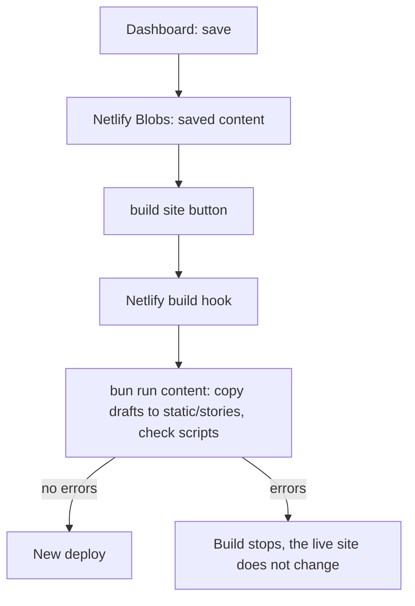

# River Walk

A location-based audio walk. Each story is a [Yarn Spinner](https://www.yarnspinner.dev/) script with audio and images. The site is a SvelteKit app on Netlify.

## Commands

```sh
bun install
bun run dev      # sync content, then start the dev server
bun run build    # sync content, check the stories, then build
bun run check    # type check
bun run content  # sync content and check the stories only
```

## Content

Each story has one folder:

```
static/stories/<story>/story.yarn
static/stories/<story>/audio/<name>.m4a
static/stories/<story>/images/<name>.webp
```

`bun run content` writes `static/stories/index.json` (the list of stories and files). This file is not in git.

### Yarn commands

| Command | Result |
| --- | --- |
| `<<recording Name "label">>` | Plays `audio/Name.m4a`. The player waits for a tap after the audio ends. |
| `<<map>>` | Shows the map at the `lat` and `long` headers of the node, with the text. |
| `<<flash name>>` | Shows `images/name.webp` full screen for 10 seconds, then fades it out. `<<flash name 5>>` shows it for 5 seconds. |
| `<<set $screen = "#cbf380">>` | Sets the background colour. |

### Node headers

| Header | Result |
| --- | --- |
| `title` | The node name. The story starts at `Start`. |
| `lat`, `long` | Coordinates for the map and the coordinate line. |
| `year` | The year line at the top of the screen. |
| `display: screen` | Shows all lines of the node at once. Without it, each tap shows one more line. |

## Dashboard

Go to `/admin`. The dashboard can:

- edit scripts, with highlight, live checks, autocomplete, and a phone preview (`/admin/<story>`)
- show the story flow as a graph (`/admin/<story>/flow`)
- upload, replace, and delete audio and images (`/admin/<story>/audio`, `/admin/<story>/images`). WAV, MP3, M4A, and FLAC files become `.m4a` in the browser.
- make new stories
- build the site with all saved stories

The bar shows "saved" or "unsaved" for the script. "build site" means that saved changes are not live yet. "rebuild site" means that the live site has all saved changes. The login lasts 90 days.

### How a build works



When a story is in the dashboard, the dashboard owns it. A build replaces `static/stories/<story>` with the dashboard version. Stories that are not in the dashboard come from git.

### Netlify settings

1. Set the base directory to `frontend`.
2. Add these environment variables:
   - `ADMIN_PASSWORD`: the dashboard password.
   - `ADMIN_SECRET` (optional): a long random string to sign the login cookie.
   - `NETLIFY_BUILD_HOOK_URL`: make a build hook in Site configuration → Build & deploy → Build hooks.
3. If the build cannot open Netlify Blobs, also set `NETLIFY_BLOBS_TOKEN` (a Netlify personal access token).
4. Register the site domain in the Stadia Maps dashboard. Without this, the map tiles show an error.

### Local work

Put `ADMIN_PASSWORD` in `.env`. Without Netlify, the dashboard keeps drafts in `.content-dev/`. In local mode, "build site" writes the saved content into `static/stories/`. Commit them to keep them.

`CONTENT_STORE=local` or `CONTENT_STORE=netlify` selects the store. `CONTENT_SYNC=off` makes the build use the files in git only. `CONTENT_STRICT=off` lets the build continue with script errors.
